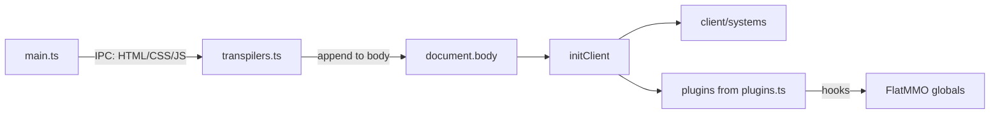

# src/renderer/ — Flat Oinky renderer

The Electron renderer process: login/character UI, FlatMMO client injection, and the
plugin overlay. Toolchain, formatting, linting, and permission rules live in the root
[AGENTS.md](../../AGENTS.md). Upstream game sources (read-only) are documented in
[refs/AGENTS.md](../../refs/AGENTS.md).

> Do not launch or test against the live Flat MMO server.

## What this folder is

The renderer has two phases in one document:

1. **Pre-client pages** — login, character select, and loader, rendered by
   [src/main.ts](src/main.ts) from `?raw` Mustache templates under `src/templates/`.
2. **In-game overlay** — the live FlatMMO page is injected into the same document;
   Flat Oinky UI mounts beside it via [src/client.ts](src/client.ts).



`mountClientPage` fetches the play page and assets over IPC, runs them through
[src/transpilers.ts](src/transpilers.ts), appends HTML/style/script to
`document.body`, then calls `initClient`. Always-on systems start from
[src/client/systems.ts](src/client/systems.ts). Toggleable plugins are registered
from the [src/plugins.ts](src/plugins.ts) barrel.

Layout under `src/`:

- `main.ts` — page routing and FlatMMO injection
- `client.ts` — lifecycle, plugin registry, client hooks, plugin context
- `transpilers.ts` — rewrite game HTML/JS and inject hooks
- `styles.css` + `styles/` — Tailwind/DaisyUI entry and component CSS
- `client/` — settings, storage, profiles, IPC facade, updater, systems, UI toolkit
- `client/systems/` — always-on features (app menu, notifications, updates, devtools,
  profiles). Systems other than profiles live on a restartable child lifecycle
  rebuilt on profile swap; the profiles system owns the Profiles & Plugins tray
  window and drives that restart.
- `plugins/` — toggleable plugins (`tweaks`, `chat`, `monitor`, `metrics`, `themes`, …)
- `templates/`, `assets/`

## Client vs plugins

- **`client/`** owns always-on infrastructure and any API more than one plugin needs.
  It is never toggleable and never registered in the plugin registry.
- **`plugins/`** owns optional features. Every plugin must be safe to stop, and
  reaches the client only through `PluginContext`.
- **`PluginContext` is the third-party contract.** Anything a plugin needs must be
  reachable from it (`character`, `ui`, `canvas`, `container`, `ipc`, `notifications`,
  `settings`, `storages`, `collections`). System-only APIs (`updater`, openDevTools,
  saveReferences) stay off the context.

## Coexisting with the FlatMMO client

- **Script hooks** — `transpileScript` wraps each name in `hookedFunctions`
  (`server_command`, `add_to_chat`, `play_sound`, `play_track`, `pause_track`) so the
  game calls `window.flatOinky.client.hooks.<fn>` first. Returning `false` suppresses
  the original. Adding a hook requires updating `hookedFunctions` and
  `PluginCallbacks` in [src/client.ts](src/client.ts).
- **CSS isolation** — game styles are injected as
  `@layer fmmo { @scope (html) to (.flat-oinky) { ... } }`, so they stop at the Oinky
  root. Oinky UI lives under `.flat-oinky`; Tailwind preflight is scoped there in
  [src/styles.css](src/styles.css).
- **Anchors** — `main.ts` tags game `<td>` cells with
  `fmmo-container="canvas|ui|topbar|misc<n>"`. Prefer those attributes when attaching
  UI to game regions.
- **Globals** — FlatMMO types and `Window`/`Globals` declarations live in
  [src/index.d.ts](src/index.d.ts). Extend that file; do not cast with `any`.

## Adding a plugin

Minimal examples: [src/plugins/themes.ts](src/plugins/themes.ts) (small) and
[src/plugins/chat.ts](src/plugins/chat.ts) (settings-heavy).

1. Create `src/plugins/<name>.ts` exporting a `Plugin`:
   - `namespace: 'oinky/<name>'`, `name`, optional `description`
   - `init(lifecycle, context)` → `PluginCallbacks`
2. Re-export it from [src/plugins.ts](src/plugins.ts). `client.ts` registers and
   starts every enabled export from that barrel (per-profile toggles live in the
   Profiles & Plugins window).
3. **Storage** — `context.storages.global | profile | character` from
   [src/client/client_storage.ts](src/client/client_storage.ts):
   - `global` — all characters / this install
   - `profile` — shared across characters on the same profile
   - `character` — one character only

     Use `.reactive(key, defaults)` and mutate the proxy; writes persist over IPC into
     SQLite automatically. Do not re-save manually. Plugin storages use context
     `plugins` with the plugin's `oinky/<name>` namespace; client internals use context
     `systems` with bare namespaces (`client`, `updater`, `notifications`, `devtools`,
     `plugins` for the enabled-plugin map).

     **Collections** — `context.collections.global | profile | character(name)` for
     append-only histories (chat messages, XP drops, …). API:
     - `fetch(quantity)` → `Promise<T[]>` (oldest→newest, up to `quantity` most recent)
     - `append(value, max?)` — fire-and-forget insert; optional `max` trims oldest rows
     Plugin collections use context `plugins` and namespace `oinky/<name>/<collection>`.
     `Plugin.init` may be async so plugins can `await collection.fetch(...)` before
     rendering.
4. **Settings** — `context.settings.initMenu(lifecycle)` then
   `mountSection(title, nodes)`. Nodes are plain `Element`s or
   `{ label, description, tooltip, reset, input, specialType }` where `specialType` is
   one of `toggle`, `textarea`, `select`, `selectTextCombo`, `selectColorCombo`,
   `alertVolume`, `alertCombo`, or `alertToggles`
   (see [src/client/settings.ts](src/client/settings.ts)). Always-on systems share a
   single `core/systems` settings entry titled System via `setupSystemApi()`.
5. **UI** — on `context.ui`:
   - Taskbar: `initMenuItem`, `initTrayButton`, `initTrayButtonMenu`, `initWidget`,
     `initActivity`, `initMenuAction`
   - Windows: `windows.initWindow(lifecycle, { id, title, storage, ... })`
   - `graphs.mountLineGraph` and helpers from `ui_utils`
6. **IPC** — `context.ipc.saveFile(filename, contents)` for save-as dialogs. Do not
   import `ipcRenderer` from plugins.

Skeleton:

```ts
import { Plugin } from '../client';
import * as el from '../client/ui/elements';

export const ExamplePlugin: Plugin = {
	namespace: 'oinky/example',
	name: 'Example',
	description: 'Minimal plugin skeleton',
	init: (lifecycle, context) => {
		const settings = context.storages.profile.reactive('settings', { enabled: true });
		const menu = context.settings.initMenu(lifecycle);
		menu.mountSection('General', [
			{
				label: 'Enabled',
				specialType: 'toggle',
				input: el.input.checkbox``.then((input) => {
					input.checked = settings.enabled;
					input.onchange = () => {
						settings.enabled = input.checked;
					};
				}),
			},
		]);
		lifecycle.onCleanup(() => {
			/* undo listeners / DOM */
		});
		return {
			onStartup: () => {},
		};
	},
};
```

## Lifecycle and element conventions

- Register cleanup with `lifecycle.onCleanup(...)`. Use `lifecycle.spawnLifecycle()` for
  subtrees that must die before the parent.
- DOM builders in [src/client/ui/elements.ts](src/client/ui/elements.ts):
  `` el.div`class names` `` then `.element`, `.then(fn)`,
  `.mount(container, id, handler)`, or `.init(lifecycle, container, id, handler)`.
  `.init` removes the node on cleanup. An `id` builds a slash-joined
  `oinky="parent/child"` path (idempotent mounts).
- Icons: `el.icon.*` (Iconify Tabler). Add new entries to that map instead of inlining
  SVG.

## Styling and templates

- Layer order and DaisyUI theme registration live in [src/styles.css](src/styles.css).
  Theme ids there must stay in sync with the `themes` array in
  [src/plugins/themes.ts](src/plugins/themes.ts).
- Custom variants: `engaged`, `locked-window`. Utilities: `pixelated`,
  `scrollbar-track-*`, `scrollbar-thumb-*`.
- Component CSS goes under `src/styles/`. HTML partials are `?raw` imports colocated
  with their module (e.g. `src/client/ui/windows/window_frame.html`).

## File organization

When a module outgrows a single file, it becomes a sibling folder of the same name
(`plugins/chat.ts` + `plugins/chat/`, `client/ui.ts` + `client/ui/`,
`client/systems.ts` + `client/systems/`). Keep `// #region` markers (see root
AGENTS.md).

## Reminders

- Do not launch the app or hit the live server (root AGENTS.md).
- Vite HMR sends a `reload-window` custom event; the renderer does a full reload.
- Dev-only behavior is gated on `process.env.NODE_ENV === 'development'` (auto-selects
  the last character, shows the Devtools button).
